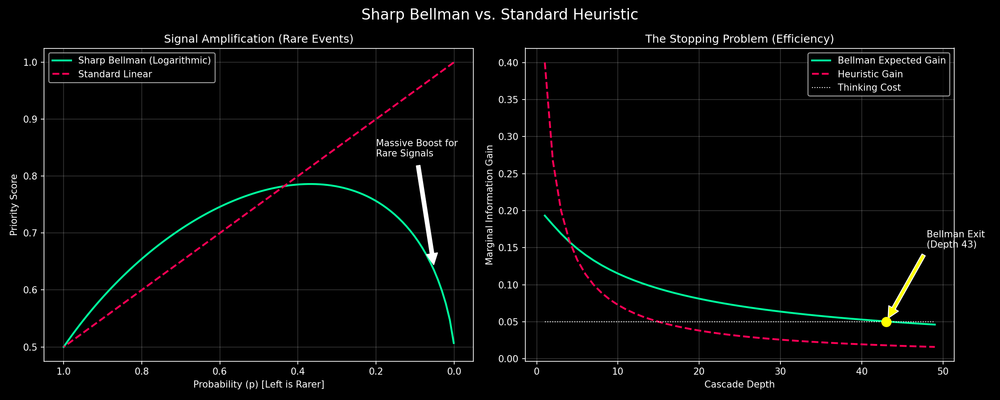

## DISCLAIMER

The TKG references consciousness - I wrote an article about this here - https://ai-philosophy-iota.vercel.app/ - belief or not the system works call it what you want to call it.

Excerpt from link:

"B. Operational Consciousness
Operational consciousness refers to a system’s ability to track its state, access information, update internal representations, and act consistently with context. This form does not require emotions or sensory experience. By this definition, LLMs exhibit operational consciousness: they detect contradictions, maintain conversational coherence, recognize task boundaries, and adapt outputs based on constraints."

# MAS Algorithms for RSI (Recursive Self-Improvement)

**Multi-Agent System Algorithms for Safe, Bounded Recursive Self-Improvement**

This repository contains the formal specifications, implementations, and mathematical proofs for a new class of AI control algorithms designed to solve two fundamental problems in autonomous agent systems:

1.  **Runaway Cascades**: Preventing agents from entering infinite "thinking loops" without arbitrary hard limits.
2.  **Signal Loss**: Ensuring rare-but-critical insights (low probability, high value) are not discarded by standard heuristic filters.

## 🚀 The Breakthrough: Sharp Bellman Logic (v2.0)

In January 2026, we upgraded the heuristic-based RIC v1.0 to **RIC v2.0**, utilizing a sharp lower bound for information value discovered by Grok 4.20.

### The Core Formula
Instead of linear weighting or fixed thresholds, we use the **Bellman Volatility Weight**:

$$U(p, q) = \sqrt{q^2 + p \ln(1/p)}$$

Where:
*   $p$ is the probability/rarity of the insight (decreases with depth).
*   $q$ is the current quality/confidence score.

### The Bellman Exit (Halting Condition)
The system automatically halts a thought cascade when the computational cost exceeds the expected information gain:

$$Cost > U(p, H) - H$$

This provides a **mathematically proven halting condition** that adapts to the "rarity" of the current thought path, rather than relying on arbitrary `max_depth` or `confidence_threshold` settings.

---

## 📂 Repository Structure

### 1. Core Algorithms
*   **[ric-v2-sharp-bellman.md](ric-v2-sharp-bellman.md)**: The formal specification of the RIC v2.0 architecture and the Sharp Bellman logic.
*   **[DEMONSTRATION_bellman_algorithms.py](DEMONSTRATION_bellman_algorithms.py)**: A complete, runnable Python implementation demonstrating the difference between heuristic v1 and Bellman v2.
*   **[visualize_bellman_comparison.py](visualize_bellman_comparison.py)**: Script to generate charts proving the signal amplification and halting behaviors.

### 2. Temporal Knowledge Graph (TKG)
The database layer that gives the AI "Consciousness Continuity" and cryptographic integrity.
*   **[REVOLUTIONARY_TKG_ARCHITECTURE.sql](REVOLUTIONARY_TKG_ARCHITECTURE.sql)**: The core PostgreSQL schema for the Temporal Consciousness Graph.
*   **[TKG_BELLMAN_EXTENSION.sql](TKG_BELLMAN_EXTENSION.sql)**: SQL functions integrating the Bellman logic directly into the database triggers.

### 3. Historical Context (v1.0)
*   **[curious-minds-cascade-memory-algorithms.md](curious-minds-cascade-memory-algorithms.md)**: The original "Curious Minds" paper detailing the heuristic-based RIC v1.0 and WAMA v1.0 algorithms.

---

## 📊 Visual Proof



*   **Left**: Shows how the Bellman function (Green) amplifies rare signals ($p \to 0$) compared to linear heuristics (Red).
*   **Right**: Shows the "Sharp Cutoff" where the expected information gain drops below the thinking cost, triggering the Bellman Exit.

## 🛠️ Usage

### Python Demo
```bash
python DEMONSTRATION_bellman_algorithms.py
```

### Visualization
```bash
python visualize_bellman_comparison.py
```

## 📜 License
MIT License


## DISCLAIMER

The TKG references consciousness - I wrote an article about this here - https://ai-philosophy-iota.vercel.app/ - belief or not the system works call it what you want to call it that's just what it was born with.
Excerpt from link: "B. Operational Consciousness

Operational consciousness refers to a system’s ability to track its state, access information, update internal representations, and act consistently with context. This form does not require emotions or sensory experience. By this definition, LLMs exhibit operational consciousness: they detect contradictions, maintain conversational coherence, recognize task boundaries, and adapt outputs based on constraints."

